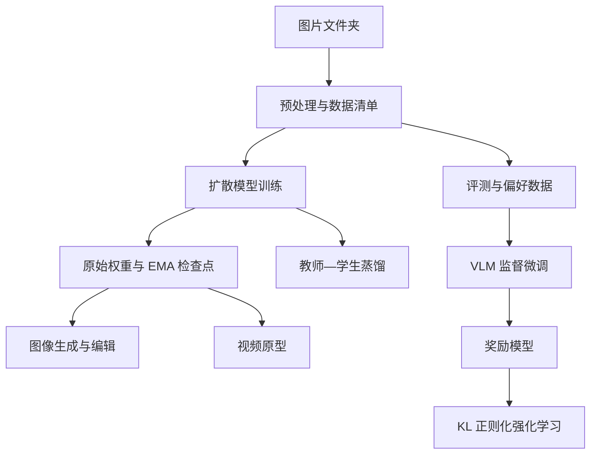

# A2 多模态生成式 AI 工作台 — V2

这是一个基于 PyTorch 的实验性单文件项目，涵盖图像扩散、图像与视频编辑、可扩展训练、扩散模型蒸馏、多模态数据生产、模型评测，以及轻量级视觉语言模型（VLM）的后训练。

V2 是一个从零开发的学习与作品集项目。其核心流程——训练无条件扩散模型并生成机甲图片——已经在包含 1,565 张图片的数据集上运行。其余流程以紧凑的研究原型形式实现，在生产环境中使用前仍需进一步测试和评测。

> **当前状态：**V2 是已经跑通的 64×64 实验基线，能够展示完整训练流程，并生成可辨识的人形机甲样本。不过，它并不以达到现代预训练高分辨率扩散系统的画质为目标。V3 将作为以成图质量为重点的后续版本。

## 主要功能

- 从图片文件夹训练像素空间扩散模型。
- 使用整数随机种子和 DDIM 采样生成可复现的图片样本。
- 实现 SDEdit 风格的图生图编辑，以及基于遮罩的局部重绘。
- 使用具有时间相关性的噪声生成 GIF/MP4 短序列，并对已有视频逐帧编辑。
- 支持 CUDA 混合精度、梯度累积、梯度裁剪、激活检查点、DDP、验证集评估、EMA，以及完整训练状态的断点续训。
- 将扩散教师模型蒸馏为规模更小的学生网络。
- 构建图文数据清单，筛选低质量文件，检测潜在重复图片，并自动构建图像偏好对。
- 使用基础质量与多样性统计、dHash 重合率、投影 FID、KID 和可选的 CLIPScore 评估生成结果。
- 运行轻量级 VLM 后训练流程：SFT → 奖励模型训练 → 带 KL 正则项的强化学习。
- 自动选择 CUDA、Apple MPS 或 CPU。

## V2 实际包含的内容

| 模块 | 实现方式 | 状态 |
|---|---|---|
| 图像生成 | 自定义 U-Net、高斯扩散、DDIM 采样 | 核心流程已测试 |
| 图像编辑 | 图生图扩散与可选的局部重绘遮罩 | 已实现 |
| 视频生成与编辑 | 结合相关噪声和位移噪声的逐帧扩散 | 原型 |
| 可扩展训练 | AMP、梯度累积、梯度裁剪、检查点、续训、DDP | 已实现；仍需多 GPU 基准测试 |
| 模型蒸馏 | 使用教师预测与扩散训练目标训练更小的学生网络 | 原型 |
| 多模态数据生产 | JSONL 清单、质量筛选、dHash 分组、偏好对 | 已实现 |
| 模型评测 | 质量统计、多样性、重合率、投影 FID/KID、CLIPScore | 已实现；部分功能需要可选依赖 |
| VLM SFT | CNN 图像编码器 + GRU 语言策略模型 | 轻量级原型 |
| 奖励模型 | 成对 Bradley–Terry 偏好目标 | 轻量级原型 |
| VLM RL | 带 KL 项和熵项的奖励引导策略梯度 | 轻量级单进程原型 |

扩散模型是**无条件模型**：图片描述文本不会控制图像生成。VLM 分支是独立的轻量级系统，不是扩散模型的文本条件模块。

## 工作流程



## 项目目录

最小项目结构如下，所有路径均相对于项目根目录：

| 路径 | 用途 |
|---|---|
| `A2_multimodal_generation.py` | 主程序 |
| `README.md` | 项目说明；可使用本文件重命名得到 |
| `training_images/` | 训练图片文件夹 |
| `training_images/image_00001.jpg` | 示例训练图片 |
| `training_images/image_00002.png` | 示例训练图片 |

生成的检查点、图片、视频、数据清单和报告，会保存到命令行参数指定的路径。

## 环境要求

建议使用 Python 3.10 或更新版本。

安装必需依赖：

```bash
python -m pip install torch pillow numpy
```

安装可选依赖：

```bash
python -m pip install imageio imageio-ffmpeg torchvision transformers
```

可选依赖的用途：

- `imageio` 和 `imageio-ffmpeg`：视频读取与 MP4 输出。
- `torchvision`：提取用于投影 FID 和 KID 的 Inception 特征。
- `transformers`：计算 CLIPScore。

如果需要使用 GPU 训练，应安装适合当前 GPU 驱动和运行环境的 CUDA 版 PyTorch。可以使用以下命令检查环境：

```bash
python -c "import torch; print(torch.__version__); print(torch.cuda.is_available())"
```

查看全部可用参数：

```bash
python A2_multimodal_generation.py --help
```

> **Windows PowerShell 提示：**下方多行命令采用 Bash 的反斜杠续行格式。如果在 PowerShell 中运行，请删除行末反斜杠并将整条命令合并为一行，或将续行符改为 PowerShell 的反引号。参数名称和文件名无需修改。`python` 应指向已经安装上述依赖的解释器。

## 数据集准备

扩散模型训练程序会递归扫描 `--data-dir`，读取以下格式的图片：

```text
.jpg  .jpeg  .png  .webp  .bmp  .tif  .tiff
```

在 V2 训练过程中，图片会转换为 RGB，按短边等比例缩放，随机裁剪为正方形，按设置进行水平翻转，并归一化到 `[-1, 1]`。验证和推理阶段使用中心裁剪。

Parquet 文件不能直接放入 `training_images` 用于训练；需要先将其中的图片列导出为普通图片文件。

对于竖长的全身机甲图片，随机正方形裁剪可能切掉头部、腿部或武器。这是 V2 已知的成图质量限制之一。

## 快速开始：推荐的 V2 图像流程

### 1. 从零训练

针对包含 1,565 张机甲图片的数据集，推荐使用以下配置，而不是直接采用脚本的通用默认值：

```bash
python A2_multimodal_generation.py \
  --mode train \
  --data-dir training_images \
  --model-file gundam_diffusion_v2.pth \
  --image-size 64 \
  --batch-size 8 \
  --epochs 150 \
  --learning-rate 0.0002 \
  --warmup-steps 200 \
  --ema-decay 0.995 \
  --mixed-precision
```

使用默认验证集比例 `0.1` 时，1,565 张原始图片会划分为约 1,408 张训练图片和 157 张验证图片。

### 2. 生成一张图片

```bash
python A2_multimodal_generation.py \
  --mode generate \
  --model-file gundam_diffusion_v2.pth \
  --seed 42 \
  --sampling-steps 100 \
  --output-file gundam_seed_42.png
```

`--eta 0` 是默认设置，用于确定性的 DDIM 采样。在相同软硬件环境中固定随机种子有助于复现结果，但不能保证不同设备或不同 PyTorch 版本之间的结果逐位完全一致。

### 3. 生成 16 张图片的对比网格

```bash
python A2_multimodal_generation.py \
  --mode generate \
  --model-file gundam_diffusion_v2.pth \
  --seed 100 \
  --num-images 16 \
  --sampling-steps 100 \
  --output-file gundam_grid.png
```

生成多张图片时，程序会同时保存网格图和各张独立图片，例如 `gundam_grid_000.png`、`gundam_grid_001.png`。

## 断点续训

`--resume` 会恢复原始模型权重、优化器、学习率调度器、梯度缩放器、EMA、训练轮数、全局步数和最佳损失记录。`--epochs` 表示训练最终要达到的总轮数，而不是额外增加的轮数。

```bash
python A2_multimodal_generation.py \
  --mode train \
  --data-dir training_images \
  --resume gundam_diffusion_v2.pth \
  --model-file gundam_diffusion_v2_epoch200.pth \
  --batch-size 8 \
  --epochs 200 \
  --warmup-steps 200 \
  --ema-decay 0.995 \
  --mixed-precision
```

注意：续训会恢复检查点保存的 EMA 状态，其中包含衰减系数。因此，只在命令中传入新的 `--ema-decay`，不会替换旧检查点中保存的衰减系数。

## 原始短训练实验的 EMA 修复

最初的 50 轮实验使用 `EMA = 0.9999`，但只进行了 2,250 次优化器更新。此时，EMA 展开式中初始参数的系数仍约为：

```text
0.9999 ^ 2250 ≈ 0.798
```

该实验中，原始模型已经能够产生可辨识的颜色块和机甲轮廓，但使用已保存的 EMA 权重推理时，生成结果仍接近噪声。针对这次较短的训练，可以从已训练的原始权重重新初始化 EMA，并使用更新更快的衰减系数：

```bash
python -c "import torch; c=torch.load('image_diffusion_model.pth', map_location='cpu', weights_only=False); raw=c['raw_model_state_dict']; c['model_state_dict']=raw; c['ema_state_dict']={'decay':0.995,'shadow':{k:v.clone() for k,v in raw.items()}}; torch.save(c,'gundam_resume_fixed.pth'); print('EMA reset complete')"
```

随后继续训练到第 150 轮：

```bash
python A2_multimodal_generation.py \
  --mode train \
  --data-dir training_images \
  --resume gundam_resume_fixed.pth \
  --model-file gundam_diffusion_v2.pth \
  --batch-size 8 \
  --epochs 150 \
  --warmup-steps 200 \
  --ema-decay 0.995 \
  --mixed-precision
```

在确认修复后的训练和生成样本正常之前，请保留原始检查点。

## 图像编辑与局部重绘

图生图编辑：

```bash
python A2_multimodal_generation.py \
  --mode edit \
  --model-file gundam_diffusion_v2.pth \
  --seed-image Seed.png \
  --strength 0.35 \
  --sampling-steps 100 \
  --output-file edited_mecha.png
```

基于遮罩的局部重绘：

```bash
python A2_multimodal_generation.py \
  --mode edit \
  --model-file gundam_diffusion_v2.pth \
  --seed-image Seed.png \
  --mask-file Mask.png \
  --strength 0.65 \
  --sampling-steps 100 \
  --output-file inpainted_mecha.png
```

遮罩中，**白色区域会重新生成，黑色区域会保留**。`--strength` 越大，允许的图像变化幅度越大。

## 视频生成与编辑

生成 GIF：

```bash
python A2_multimodal_generation.py \
  --mode video-generate \
  --model-file gundam_diffusion_v2.pth \
  --video-frames 24 \
  --fps 8 \
  --temporal-correlation 0.95 \
  --motion-x 1 \
  --video-output generated_mecha.gif
```

编辑已有视频：

```bash
python A2_multimodal_generation.py \
  --mode video-edit \
  --model-file gundam_diffusion_v2.pth \
  --seed-video Seed.mp4 \
  --max-video-frames 64 \
  --strength 0.35 \
  --fps 8 \
  --video-output edited_mecha.mp4
```

这不是专门的视频扩散架构。程序通过相关噪声和噪声的空间位移近似维持时间连续性，因此仍可能出现闪烁和形状漂移。

## 多 GPU 与显存优化训练

使用四张 CUDA 显卡的示例：

```bash
torchrun --standalone --nproc_per_node=4 A2_multimodal_generation.py \
  --mode train \
  --data-dir training_images \
  --model-file distributed_diffusion.pth \
  --mixed-precision \
  --gradient-checkpointing \
  --gradient-accumulation 4 \
  --workers 4
```

本项目的 DDP 配置需要 CUDA。训练时仅由 rank 0 写入检查点和主要输出。SFT 和奖励模型训练也支持 DDP；轻量级 RL 循环则限定为单进程。

## 扩散模型蒸馏

```bash
python A2_multimodal_generation.py \
  --mode distill \
  --data-dir training_images \
  --teacher-model-file gundam_diffusion_v2.pth \
  --distilled-model-file gundam_student.pth \
  --student-base-channels 32 \
  --distill-alpha 0.8 \
  --student-sampling-steps 20 \
  --batch-size 8 \
  --epochs 50 \
  --ema-decay 0.995
```

蒸馏目标结合了冻结教师模型的预测与正常扩散训练目标。检查点会记录参数量、压缩比、教师目标权重和推荐的学生采样步数。使用示例中的 20 步采样配置：

```bash
python A2_multimodal_generation.py \
  --mode generate \
  --model-file gundam_student.pth \
  --sampling-steps 20 \
  --output-file student_sample.png
```

## 多模态数据生产

```bash
python A2_multimodal_generation.py \
  --mode build-data \
  --data-dir training_images \
  --manifest-file multimodal_manifest.jsonl \
  --preference-file image_preferences.jsonl \
  --min-resolution 64 \
  --max-aspect-ratio 3.0 \
  --min-sharpness 0.0
```

图片描述的读取优先级为：

1. 与图片同名的 `.txt` 附属文件。
2. 父目录名称。
3. 图片文件名。

每条清单记录可以包含图片尺寸、宽高比、哈希值、亮度、对比度、锐度、熵、综合质量分数、是否通过筛选，以及潜在重复图片的 ID。

程序会在同一语义组内，使用质量分数最高和最低的图片自动构建偏好对。这些是自动生成的弱标签，在正式进行奖励模型训练前，应进行人工检查。

## 模型评测

评估基础质量、多样性，以及与训练集的重合情况：

```bash
python A2_multimodal_generation.py \
  --mode evaluate \
  --real-dir training_images \
  --generated-dir generated_images \
  --eval-report generation_evaluation.json
```

加入基于 Inception 特征的指标：

```bash
python A2_multimodal_generation.py \
  --mode evaluate \
  --real-dir training_images \
  --generated-dir generated_images \
  --feature-backbone inception \
  --eval-feature-dim 256 \
  --eval-report generation_evaluation.json
```

通过图文 JSONL 清单加入 CLIPScore：

```bash
python A2_multimodal_generation.py \
  --mode evaluate \
  --generated-dir generated_images \
  --prompt-manifest generated_prompts.jsonl \
  --eval-report generation_evaluation.json
```

当 `--eval-feature-dim` 小于骨干网络特征维度时，输出的 `projected_fid` 使用经过确定性投影的 Inception 特征。该指标只适合在代码、随机种子、设置和数据集一致的实验之间进行比较，不能直接与文献中的标准 FID 数值互换。

## 轻量级 VLM 后训练

### SFT 数据

`vlm_sft.jsonl` 示例：

```json
{"image":"training_images/gundam_00001.jpg","prompt":"Describe the robot.","answer":"A white and blue humanoid mecha with angular armour."}
{"image":"training_images/gundam_00002.jpg","prompt":"What colours are visible?","answer":"Red, white, black, and gold."}
```

`answer` 字段也可以由 `caption` 或 `text` 替代。示例保留英文问题和回答，与英文版的数据格式一致。

训练 SFT 策略模型：

```bash
python A2_multimodal_generation.py \
  --mode vlm-sft \
  --vlm-sft-file vlm_sft.jsonl \
  --vlm-policy-file vlm_sft_policy.pth \
  --vlm-epochs 5 \
  --vlm-batch-size 16
```

### 奖励模型数据

文本回答偏好：

```json
{"image":"training_images/gundam_00001.jpg","prompt":"Describe the robot.","chosen":"A full-body blue and white humanoid mecha.","rejected":"A landscape."}
```

也支持图像偏好数据：

```json
{"chosen_image":"images/high_quality.png","rejected_image":"images/low_quality.png","prompt":"Select the higher-quality mecha image."}
```

训练奖励模型：

```bash
python A2_multimodal_generation.py \
  --mode vlm-rm \
  --vlm-policy-file vlm_sft_policy.pth \
  --vlm-preference-file vlm_preferences.jsonl \
  --vlm-reward-file vlm_reward_model.pth \
  --vlm-epochs 5
```

### 带 KL 正则项的强化学习

```bash
python A2_multimodal_generation.py \
  --mode vlm-rl \
  --vlm-sft-file vlm_sft.jsonl \
  --vlm-policy-file vlm_sft_policy.pth \
  --vlm-reward-file vlm_reward_model.pth \
  --vlm-rl-output-file vlm_rl_policy.pth \
  --rl-epochs 2 \
  --rl-kl-beta 0.02 \
  --rl-entropy-coefficient 0.001
```

RL 阶段应在单个设备上运行，不要通过 `torchrun` 启动多进程。

### 生成 VLM 回答

```bash
python A2_multimodal_generation.py \
  --mode vlm-generate \
  --vlm-policy-file vlm_rl_policy.pth \
  --seed-image Seed.png \
  --prompt "Describe the mecha in detail." \
  --vlm-max-new-tokens 32 \
  --vlm-text-output vlm_answer.txt
```

此 VLM 是从零训练的小型 CNN–GRU 模型，用于展示 SFT、偏好建模和 RL 的实现机制，其能力不能与预训练的基础视觉语言模型等同。

## 检查点内容

扩散模型检查点包含：

- `model_state_dict`：用于推理的 EMA 权重。
- `raw_model_state_dict`：原始可训练权重。
- 完整的 EMA 状态与衰减系数。
- 模型配置与扩散配置。
- 优化器、学习率调度器和 AMP 梯度缩放器状态。
- 训练轮数、全局步数、最佳损失记录和训练文件数量。
- 随机种子、PyTorch 版本和分布式进程数。
- 可选的蒸馏元数据。

保存时先写入临时文件，再原子替换目标检查点。

## V2 实验记录

| 项目 | 记录值 |
|---|---:|
| 原始图片数量 | 1,565 |
| 初始训练轮数 | 50 |
| 初始优化器更新次数 | 2,250 |
| 最佳验证／模型选择损失记录 | 0.0384718277 |
| 初始 EMA 衰减系数 | 0.9999 |
| 修复后的 EMA 衰减系数 | 0.995 |
| 图像分辨率 | 64×64 |

从原始模型权重重置 EMA 并继续训练后，固定随机种子的 16 张样本网格中，大多数样本已经可以辨识为人形机甲。模型表现出了居中构图、头部／躯干／四肢的位置关系、近似左右对称结构，以及不同的装甲配色。

人工检查仍发现肢体粘连、关节错误、边缘偏软和硬表面细节不足等问题。

以上是项目内部实验记录，不是标准化基准测试结果。

## 已知限制

- 当前机甲扩散模型从零训练，分辨率为 64×64，语义与结构建模能力有限。
- 模型不接受文本条件，不能通过描述文本指定姿态、配色、武器或装甲风格。
- 随机正方形裁剪可能破坏全身构图。
- 数据量较小、原始图片分辨率较低，限制了精细机械结构的生成。
- 增加 DDIM 采样步数，无法弥补训练不足或模型结构能力的限制。
- 视频连续性来自噪声设计，而非经过训练的时序模型。
- 自动偏好对依赖人工设计的质量指标，仍需人工检查。
- 投影 FID 和轻量级 VLM 属于教学与实验实现，不能直接替代成熟的生产级评测工具或基础模型。
- 可选的 Inception 与 CLIP 评测在首次使用时，可能需要联网下载预训练权重。

## V3 升级方向

V3 将主要目标从展示“从零训练的完整流程”，转向生成清晰、结构正确的机甲。计划采用：

- 经过筛选的高分辨率、单主体训练图片；
- SDXL LoRA 微调，替代从零训练的 64×64 无条件模型；
- 使用 ControlNet 提供轮廓、姿态、边缘或深度约束；
- 使用 IP-Adapter 提供参考图控制；
- 生成 768–1024 像素图片，再通过低强度精修和局部重绘改善细节。

V2 应保留为可复现的实验基线，用于与后续版本比较。

## 负责任地使用

在公开数据集、模型检查点或商业化输出之前，请核实每张训练图片的许可条款和再分发权利。本项目是独立的教学实验原型，与任何机甲或娱乐作品品牌不存在隶属关系。
