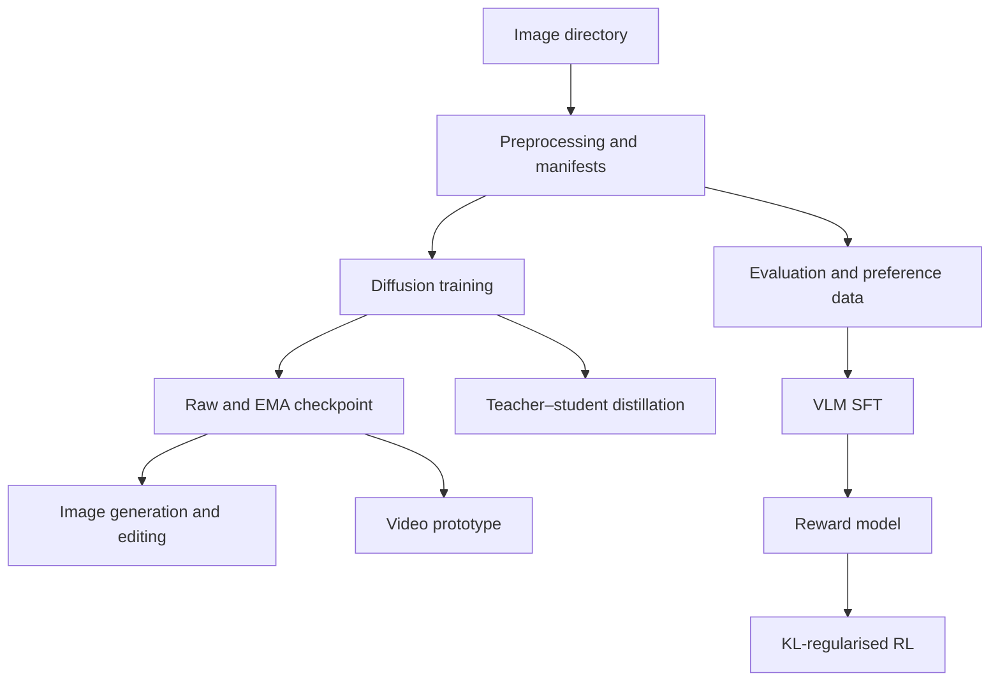

# A2 Multimodal Generative AI Workbench — V2

An experimental, single-file PyTorch workbench for image diffusion, image and
video editing, scalable training, diffusion distillation, multimodal data
production, model evaluation, and lightweight VLM post-training.

V2 was developed as a from-scratch learning and portfolio project. Its primary
workflow—training an unconditional diffusion model and generating mecha
images—has been exercised on 1,565 images. The remaining workflows are
implemented as compact research prototypes and should be benchmarked before
production use.

> **Current status:** V2 is the working 64×64 baseline. It demonstrates the
> complete training pipeline and produces recognisable humanoid-mecha samples,
> but it is not intended to match modern pretrained high-resolution diffusion
> systems. V3 is planned as the quality-focused successor.

## Highlights

- Train a pixel-space diffusion model from an image directory.
- Generate reproducible image samples from integer seeds with DDIM sampling.
- Perform SDEdit-style image-to-image editing and mask-based inpainting.
- Produce short GIF/MP4 sequences with temporally correlated noise and edit
  existing videos frame by frame.
- Use CUDA mixed precision, gradient accumulation, gradient clipping,
  activation checkpointing, DDP, validation, EMA, and full checkpoint resume.
- Distil a diffusion teacher into a smaller student network.
- Build image–text manifests, filter low-quality files, detect potential
  duplicates, and bootstrap image preference pairs.
- Evaluate generated images with basic quality/diversity statistics,
  dHash overlap, projected FID, KID, and optional CLIPScore.
- Run a compact VLM post-training pipeline: SFT → reward modelling →
  KL-regularised reinforcement learning.
- Select CUDA, Apple MPS, or CPU automatically.

## What V2 Actually Contains

| Area | Implementation | Status |
|---|---|---|
| Image generation | Custom U-Net, Gaussian diffusion, DDIM sampling | Core workflow tested |
| Image editing | Image-to-image diffusion and optional inpainting mask | Implemented |
| Video generation/editing | Frame-wise diffusion with correlated and shifted noise | Prototype |
| Scalable training | AMP, accumulation, clipping, checkpointing, resume, DDP | Implemented; multi-GPU benchmarking still required |
| Distillation | Smaller student trained against teacher and diffusion targets | Prototype |
| Multimodal data production | JSONL manifest, quality filters, dHash groups, preference pairs | Implemented |
| Model evaluation | Quality statistics, diversity, overlap, projected FID/KID, CLIPScore | Implemented; optional dependencies required |
| VLM SFT | CNN image encoder + GRU language policy | Lightweight prototype |
| Reward model | Pairwise Bradley–Terry preference objective | Lightweight prototype |
| VLM RL | Reward-guided policy gradient with KL and entropy terms | Lightweight, single-process prototype |

The diffusion model is **unconditional**: captions do not control image
generation. The VLM branch is a separate lightweight system and is not a text
conditioner for the diffusion model.

## Workflow



## Repository Layout

Minimal layout:

```text
project/
├── A2_multimodal_generation.py
├── README.md
└── training_images/
    ├── image_00001.jpg
    ├── image_00002.png
    └── ...
```

Generated checkpoints, images, videos, manifests, and reports are written to
the paths supplied on the command line.

## Requirements

Python 3.10 or newer is recommended.

Required packages:

```bash
python -m pip install torch pillow numpy
```

Optional packages:

```bash
python -m pip install imageio imageio-ffmpeg torchvision transformers
```

Optional dependency usage:

- `imageio` and `imageio-ffmpeg`: video input and MP4 output.
- `torchvision`: Inception features for projected FID and KID.
- `transformers`: CLIPScore.

Install the PyTorch build appropriate for the local CUDA version when GPU
training is required. Confirm the environment with:

```bash
python -c "import torch; print(torch.__version__); print(torch.cuda.is_available())"
```

Display every available option with:

```bash
python A2_multimodal_generation.py --help
```

## Dataset Preparation

The diffusion trainer recursively scans `--data-dir` for:

```text
.jpg  .jpeg  .png  .webp  .bmp  .tif  .tiff
```

During V2 training, images are converted to RGB, resized according to their
shorter side, randomly square-cropped, optionally flipped horizontally, and
normalised to `[-1, 1]`. Validation and inference use a centred crop.

Parquet files cannot be placed directly in `training_images`; extract their
image column to ordinary image files first.

For tall, full-body mecha datasets, note that random square cropping can remove
the head, legs, or weapons. This is one of V2's known quality limitations.

## Quick Start: Recommended V2 Image Workflow

### 1. Train from scratch

The following settings are better suited to the 1,565-image mecha dataset than
the script's generic defaults:

```bash
python A2_multimodal_generation.py \
  --mode train \
  --data-dir training_images \
  --model-file gundam_diffusion_v2.pth \
  --image-size 64 \
  --batch-size 8 \
  --epochs 150 \
  --learning-rate 0.0002 \
  --warmup-steps 200 \
  --ema-decay 0.995 \
  --mixed-precision
```

With the default validation fraction of `0.1`, 1,565 source images produce
approximately 1,408 training images and 157 validation images.

### 2. Generate one image

```bash
python A2_multimodal_generation.py \
  --mode generate \
  --model-file gundam_diffusion_v2.pth \
  --seed 42 \
  --sampling-steps 100 \
  --output-file gundam_seed_42.png
```

`--eta 0` is the default and gives deterministic DDIM sampling for a fixed
seed within the same software and hardware environment. Bitwise-identical
results are not guaranteed across different devices or PyTorch versions.

### 3. Generate a 16-image comparison grid

```bash
python A2_multimodal_generation.py \
  --mode generate \
  --model-file gundam_diffusion_v2.pth \
  --seed 100 \
  --num-images 16 \
  --sampling-steps 100 \
  --output-file gundam_grid.png
```

For multiple images, the script saves both the grid and individual files such
as `gundam_grid_000.png` and `gundam_grid_001.png`.

## Resume Training

`--resume` restores the raw model, optimiser, scheduler, gradient scaler, EMA,
epoch, global step, and best loss. `--epochs` is the final target epoch rather
than the number of additional epochs.

```bash
python A2_multimodal_generation.py \
  --mode train \
  --data-dir training_images \
  --resume gundam_diffusion_v2.pth \
  --model-file gundam_diffusion_v2_epoch200.pth \
  --batch-size 8 \
  --epochs 200 \
  --warmup-steps 200 \
  --ema-decay 0.995 \
  --mixed-precision
```

Important: a resumed checkpoint restores its saved EMA state, including its
saved decay. Therefore, passing a new `--ema-decay` does not replace the decay
stored inside an older checkpoint.

## EMA Recovery for the Original Short Run

The first 50-epoch experiment used `EMA = 0.9999` for only 2,250 optimiser
updates. At that point, the EMA still retained approximately:

```text
0.9999 ^ 2250 ≈ 0.798
```

of its initial state. The raw model produced recognisable colour blocks and
mecha silhouettes, while the saved EMA inference weights remained close to
noise. For this small run, reset EMA from the trained raw weights and use a
faster decay:

```bash
python -c "import torch; c=torch.load('image_diffusion_model.pth', map_location='cpu', weights_only=False); raw=c['raw_model_state_dict']; c['model_state_dict']=raw; c['ema_state_dict']={'decay':0.995,'shadow':{k:v.clone() for k,v in raw.items()}}; torch.save(c,'gundam_resume_fixed.pth'); print('EMA reset complete')"
```

Then resume to epoch 150:

```bash
python A2_multimodal_generation.py \
  --mode train \
  --data-dir training_images \
  --resume gundam_resume_fixed.pth \
  --model-file gundam_diffusion_v2.pth \
  --batch-size 8 \
  --epochs 150 \
  --warmup-steps 200 \
  --ema-decay 0.995 \
  --mixed-precision
```

Keep the original checkpoint until the repaired run and its generated samples
have been verified.

## Image Editing and Inpainting

Image-to-image editing:

```bash
python A2_multimodal_generation.py \
  --mode edit \
  --model-file gundam_diffusion_v2.pth \
  --seed-image Seed.png \
  --strength 0.35 \
  --sampling-steps 100 \
  --output-file edited_mecha.png
```

Mask-based inpainting:

```bash
python A2_multimodal_generation.py \
  --mode edit \
  --model-file gundam_diffusion_v2.pth \
  --seed-image Seed.png \
  --mask-file Mask.png \
  --strength 0.65 \
  --sampling-steps 100 \
  --output-file inpainted_mecha.png
```

In the mask, **white pixels are regenerated** and **black pixels are
preserved**. Higher `--strength` values permit larger changes.

## Video Generation and Editing

Generate a GIF:

```bash
python A2_multimodal_generation.py \
  --mode video-generate \
  --model-file gundam_diffusion_v2.pth \
  --video-frames 24 \
  --fps 8 \
  --temporal-correlation 0.95 \
  --motion-x 1 \
  --video-output generated_mecha.gif
```

Edit an existing video:

```bash
python A2_multimodal_generation.py \
  --mode video-edit \
  --model-file gundam_diffusion_v2.pth \
  --seed-video Seed.mp4 \
  --max-video-frames 64 \
  --strength 0.35 \
  --fps 8 \
  --video-output edited_mecha.mp4
```

This is not a dedicated video diffusion architecture. Temporal consistency is
approximated through correlated, spatially shifted noise, so flicker and shape
drift can remain.

## Multi-GPU and Memory-Efficient Training

Example with four CUDA devices:

```bash
torchrun --standalone --nproc_per_node=4 A2_multimodal_generation.py \
  --mode train \
  --data-dir training_images \
  --model-file distributed_diffusion.pth \
  --mixed-precision \
  --gradient-checkpointing \
  --gradient-accumulation 4 \
  --workers 4
```

DDP requires CUDA. Only rank 0 writes checkpoints and final outputs. SFT and
reward-model training can also use DDP; the compact RL loop is intentionally
single-process.

## Diffusion Distillation

```bash
python A2_multimodal_generation.py \
  --mode distill \
  --data-dir training_images \
  --teacher-model-file gundam_diffusion_v2.pth \
  --distilled-model-file gundam_student.pth \
  --student-base-channels 32 \
  --distill-alpha 0.8 \
  --student-sampling-steps 20 \
  --batch-size 8 \
  --epochs 50 \
  --ema-decay 0.995
```

The objective blends the frozen teacher prediction and the normal diffusion
training target. The checkpoint records parameter counts, compression ratio,
teacher weight, and recommended student sampling steps. To use the suggested
20-step sampler:

```bash
python A2_multimodal_generation.py \
  --mode generate \
  --model-file gundam_student.pth \
  --sampling-steps 20 \
  --output-file student_sample.png
```

## Multimodal Data Production

```bash
python A2_multimodal_generation.py \
  --mode build-data \
  --data-dir training_images \
  --manifest-file multimodal_manifest.jsonl \
  --preference-file image_preferences.jsonl \
  --min-resolution 64 \
  --max-aspect-ratio 3.0 \
  --min-sharpness 0.0
```

Caption priority:

1. Same-name `.txt` sidecar.
2. Parent directory name.
3. Image filename.

Each manifest record can contain dimensions, aspect ratio, hashes, brightness,
contrast, sharpness, entropy, a combined quality score, acceptance state, and
potential duplicate IDs. Preference pairs are automatically bootstrapped from
the highest- and lowest-scoring images within a semantic group; they are weak
automatic labels and should be manually reviewed before serious RM training.

## Evaluation

Basic quality, diversity, and training-set overlap:

```bash
python A2_multimodal_generation.py \
  --mode evaluate \
  --real-dir training_images \
  --generated-dir generated_images \
  --eval-report generation_evaluation.json
```

Add Inception feature metrics:

```bash
python A2_multimodal_generation.py \
  --mode evaluate \
  --real-dir training_images \
  --generated-dir generated_images \
  --feature-backbone inception \
  --eval-feature-dim 256 \
  --eval-report generation_evaluation.json
```

Add CLIPScore with an image–text JSONL manifest:

```bash
python A2_multimodal_generation.py \
  --mode evaluate \
  --generated-dir generated_images \
  --prompt-manifest generated_prompts.jsonl \
  --eval-report generation_evaluation.json
```

The reported `projected_fid` uses a deterministic projection of Inception
features when `--eval-feature-dim` is smaller than the backbone dimension. It
should be compared only across runs using the same code, seed, settings, and
dataset; it is not directly interchangeable with published standard FID
numbers.

## Lightweight VLM Post-Training

### SFT data

`vlm_sft.jsonl`:

```json
{"image":"training_images/gundam_00001.jpg","prompt":"Describe the robot.","answer":"A white and blue humanoid mecha with angular armour."}
{"image":"training_images/gundam_00002.jpg","prompt":"What colours are visible?","answer":"Red, white, black, and gold."}
```

`caption` or `text` may replace `answer`.

Train the SFT policy:

```bash
python A2_multimodal_generation.py \
  --mode vlm-sft \
  --vlm-sft-file vlm_sft.jsonl \
  --vlm-policy-file vlm_sft_policy.pth \
  --vlm-epochs 5 \
  --vlm-batch-size 16
```

### Reward-model data

Text-response preferences:

```json
{"image":"training_images/gundam_00001.jpg","prompt":"Describe the robot.","chosen":"A full-body blue and white humanoid mecha.","rejected":"A landscape."}
```

Image preferences are also accepted:

```json
{"chosen_image":"images/high_quality.png","rejected_image":"images/low_quality.png","prompt":"Select the higher-quality mecha image."}
```

Train the reward model:

```bash
python A2_multimodal_generation.py \
  --mode vlm-rm \
  --vlm-policy-file vlm_sft_policy.pth \
  --vlm-preference-file vlm_preferences.jsonl \
  --vlm-reward-file vlm_reward_model.pth \
  --vlm-epochs 5
```

### KL-regularised RL

```bash
python A2_multimodal_generation.py \
  --mode vlm-rl \
  --vlm-sft-file vlm_sft.jsonl \
  --vlm-policy-file vlm_sft_policy.pth \
  --vlm-reward-file vlm_reward_model.pth \
  --vlm-rl-output-file vlm_rl_policy.pth \
  --rl-epochs 2 \
  --rl-kl-beta 0.02 \
  --rl-entropy-coefficient 0.001
```

Run RL on one device, not through `torchrun`.

### Generate a VLM response

```bash
python A2_multimodal_generation.py \
  --mode vlm-generate \
  --vlm-policy-file vlm_rl_policy.pth \
  --seed-image Seed.png \
  --prompt "Describe the mecha in detail." \
  --vlm-max-new-tokens 32 \
  --vlm-text-output vlm_answer.txt
```

This VLM is a small CNN–GRU model trained from scratch. It demonstrates the
mechanics of SFT, preference modelling, and RL, but it is not comparable to a
pretrained foundation VLM.

## Checkpoint Contents

Diffusion checkpoints contain:

- EMA inference weights in `model_state_dict`.
- Raw trainable weights in `raw_model_state_dict`.
- Full EMA state and decay.
- Model and diffusion configuration.
- Optimiser, scheduler, and AMP scaler states.
- Epoch, global step, best stored loss, and training-file count.
- Seed, PyTorch version, and world size.
- Optional distillation metadata.

Checkpoints are written atomically through a temporary file and then replaced.

## V2 Experiment Snapshot

| Item | Recorded value |
|---|---:|
| Source images | 1,565 |
| Initial training epochs | 50 |
| Initial optimiser updates | 2,250 |
| Best stored validation/selection loss | 0.0384718277 |
| Initial EMA decay | 0.9999 |
| Repaired EMA decay | 0.995 |
| Image resolution | 64×64 |

After resetting EMA from the raw model and continuing training, a fixed-seed
16-image grid showed that most samples were recognisable as humanoid mecha. The
model learned centred composition, head/torso/limb placement, approximate
bilateral symmetry, and varied armour colours. Manual review still identified
fused limbs, incorrect joints, soft edges, and limited hard-surface detail.

This snapshot is an internal experiment record, not a standard benchmark.

## Known Limitations

- The diffusion model is trained from scratch at 64×64 and has limited semantic
  and structural understanding.
- It is unconditional, so text captions cannot request a particular pose,
  colour scheme, weapon, or armour style.
- Random square cropping can damage full-body composition.
- Small datasets and low-resolution source images limit fine mechanical detail.
- More DDIM steps cannot compensate for an undertrained or structurally limited
  model.
- Video consistency is noise-based rather than learned by a temporal model.
- Automatic preference pairs use handcrafted quality signals and require human
  review.
- Projected FID and the compact VLM are educational implementations, not direct
  replacements for established production evaluation or foundation models.
- Pretrained weights used by optional Inception and CLIP evaluation may require
  an internet connection on first use.

## V3 Direction

V3 shifts the main objective from demonstrating a from-scratch pipeline to
generating clear, structurally correct mecha. The planned route is:

- curated high-resolution, single-subject training images;
- SDXL LoRA rather than a 64×64 unconditional model trained from scratch;
- ControlNet for silhouette, pose, edge, or depth constraints;
- IP-Adapter for visual-reference control;
- 768–1024 px generation followed by low-strength refinement and local
  inpainting.

V2 should remain available as the reproducible baseline for comparison.

## Responsible Use

Verify the licence and redistribution rights of every training image before
publishing datasets, checkpoints, or commercial outputs. This project is an
independent educational prototype and is not affiliated with any mecha or
entertainment franchise.

